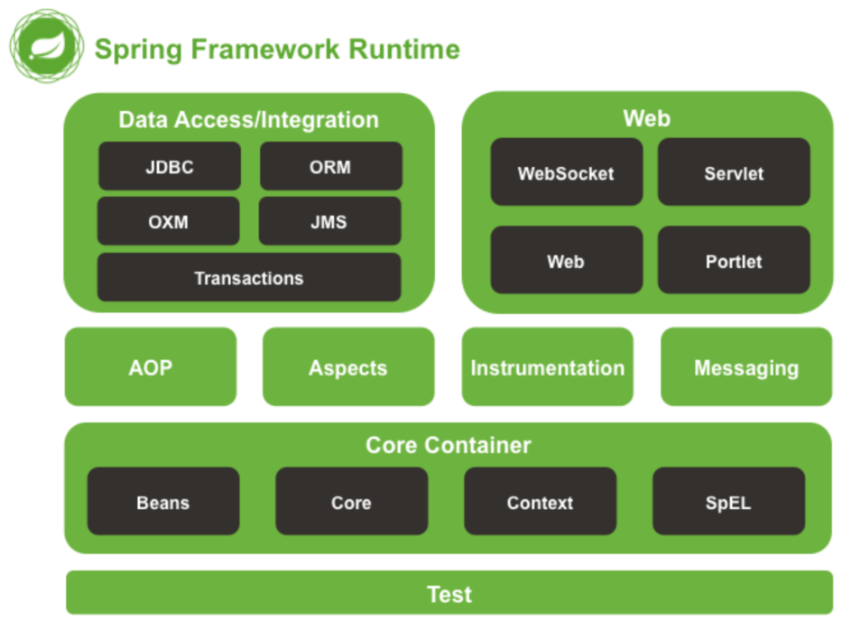

##[Spring](https://spring.io/) 的IOC 和AOP
Spring重要模块

### IOC 面向控制反转

### AOP 面向切面

## 关于Thymeleaf
### 学习资料
### 相关知识点

## 源码
[在线电子书](https://potoyang.gitbook.io/spring-in-action-v5/)  
[gitlab源码地址](https://github.com/levinzhang1981/spring-in-action-5-samples)

## 必要的前端知识
[html](https://www.runoob.com/html/html-tutorial.html)  
[js](https://www.runoob.com/js/js-tutorial.html)  
[css](https://www.runoob.com/css/css-tutorial.html)  

## 常见的前端
[thymeleaf官网](https://www.thymeleaf.org/documentation.html)
[thymeleaf中文教程](https://www.docs4dev.com/docs/zh/thymeleaf/3.0/reference/using_thymeleaf.html#introducing-thymeleaf)  
[element-ui](https://element.eleme.cn/#/zh-CN)  
[vue](https://cn.vuejs.org/v2/guide/team.html)

##Tips
### @Controller 和@RestController 的区别
### 将⼀个类声明为Spring的 bean 的注解有哪些?
一般使用@Autowired 注解自动装配bean,要想把类标识成可用于@Autowired 注解自动装配的bean的类，采用以下注解可实现：
- **@Component :**通用的注解，可标记任意类为Spring组件。如果一个Bean不知道属于哪个层，可以使用@Component注解标注。
- **@Repository :**对应持久层即Dao层，主要用于数据库相关操作（CURD）。
- **@Service :** 对应服务层，主要涉及一些复杂的逻辑，需要用到Dao层。
- **@Controller : **对应Spring MVC控制层，主要用于接受用户请求并调用Service层返回数据给前端页面。

### Spring DevTools 配置参考
[devtools实现热部署](https://www.cnblogs.com/lspz/p/6832358.html)

### Lombok 配置参考
[lombok配置参考](https://blog.csdn.net/zhglance/article/details/54931430)  
[lombok详解指南](https://mp.weixin.qq.com/s/R-OplNkv6cfXmSn--VuH3w)
